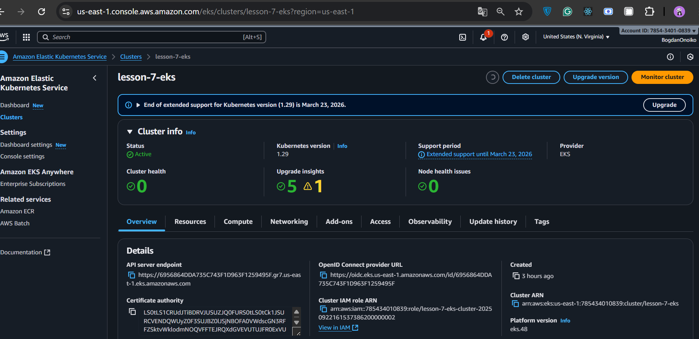

# Lesson 8-9 — AWS EKS + ECR + Helm + Django + HPA + GitOps (Argo CD)

Production-friendly демо інфраструктури:
- **Terraform** розгортає **VPC + EKS + ECR + Argo CD + Jenkins**.
- **Jenkins (Kaniko + IRSA)** збирає образ, пушить у **ECR** і оновлює тег у **Helm values** GitOps-репозиторію.
- **Argo CD** підхоплює зміни з Git і синхронізує застосунок у кластері.
- **HPA** масштабує `Deployment` за метриками.

---

## 0) Передумови

- AWS акаунт із правами на EKS/ECR/VPC/IRSA.
- Встановлено: `terraform` ≥ 1.5, `kubectl`, `awscli`, `helm` (опц. `yq`).
- Налаштований `aws configure` (або профіль з потрібними правами).
- Docker потрібен лише для ручних перевірок локального білду.

---

## 1) Структура репозиторію

Progect/
│
├── main.tf                  # Головний файл для підключення модулів
├── backend.tf               # Налаштування бекенду для стейтів (S3 + DynamoDB
├── outputs.tf               # Загальні виводи ресурсів
│
├── modules/                 # Каталог з усіма модулями
│   ├── s3-backend/          # Модуль для S3 та DynamoDB
│   │   ├── s3.tf            # Створення S3-бакета
│   │   ├── dynamodb.tf      # Створення DynamoDB
│   │   ├── variables.tf     # Змінні для S3
│   │   └── outputs.tf       # Виведення інформації про S3 та DynamoDB
│   │
│   ├── vpc/                 # Модуль для VPC
│   │   ├── vpc.tf           # Створення VPC, підмереж, Internet Gateway
│   │   ├── routes.tf        # Налаштування маршрутизації
│   │   ├── variables.tf     # Змінні для VPC
│   │   └── outputs.tf  
│   ├── ecr/                 # Модуль для ECR
│   │   ├── ecr.tf           # Створення ECR репозиторію
│   │   ├── variables.tf     # Змінні для ECR
│   │   └── outputs.tf       # Виведення URL репозиторію
│   │
│   ├── eks/                      # Модуль для Kubernetes кластера
│   │   ├── eks.tf                # Створення кластера
│   │   ├── aws_ebs_csi_driver.tf # Встановлення плагіну csi drive
│   │   ├── variables.tf     # Змінні для EKS
│   │   └── outputs.tf       # Виведення інформації про кластер
│   │
│   ├── rds/                 # Модуль для RDS
│   │   ├── rds.tf           # Створення RDS бази даних  
│   │   ├── aurora.tf        # Створення aurora кластера бази даних  
│   │   ├── shared.tf        # Спільні ресурси  
│   │   ├── variables.tf     # Змінні (ресурси, креденшели, values)
│   │   └── outputs.tf  
│   │ 
│   ├── jenkins/             # Модуль для Helm-установки Jenkins
│   │   ├── jenkins.tf       # Helm release для Jenkins
│   │   ├── variables.tf     # Змінні (ресурси, креденшели, values)
│   │   ├── providers.tf     # Оголошення провайдерів
│   │   ├── values.yaml      # Конфігурація jenkins
│   │   └── outputs.tf       # Виводи (URL, пароль адміністратора)
│   │ 
│   └── argo_cd/             # ✅ Новий модуль для Helm-установки Argo CD
│       ├── jenkins.tf       # Helm release для Jenkins
│       ├── variables.tf     # Змінні (версія чарта, namespace, repo URL тощо)
│       ├── providers.tf     # Kubernetes+Helm.  переносимо з модуля jenkins
│       ├── values.yaml      # Кастомна конфігурація Argo CD
│       ├── outputs.tf       # Виводи (hostname, initial admin password)
│		    └──charts/                  # Helm-чарт для створення app'ів
│ 	 	    ├── Chart.yaml
│	  	    ├── values.yaml          # Список applications, repositories
│			    └── templates/
│		        ├── application.yaml
│		        └── repository.yaml
├── charts/
│   └── django-app/
│       ├── templates/
│       │   ├── deployment.yaml
│       │   ├── service.yaml
│       │   ├── configmap.yaml
│       │   └── hpa.yaml
│       ├── Chart.yaml
│       └── values.yaml     # ConfigMap зі змінними середовища

## 2) Швидкий старт

```bash
terraform init

terraform apply -auto-approve   -var="aws_region=us-east-1"   -var="ecr_name=lesson-7-ecr"   -var="eks_cluster_name=lesson-7-eks"   -var="eks_version=1.29"
```

Очікувані outputs (серед іншого):
- `ecr_repository_url`
- `cluster_name`, `cluster_endpoint`, `cluster_oidc_issuer_url`
- `vpc_id`
- `argocd_namespace`, `argocd_server_dns`, `argocd_admin_password_hint`
- `jenkins_release`, `jenkins_namespace`

> Використовується **IRSA** — ключі AWS у Secret **не потрібні**.

---

## 3) kubectl доступ до EKS

```bash
AWS_REGION=us-east-1
EKS_NAME=$(terraform output -raw cluster_name)

aws eks --region "$AWS_REGION" update-kubeconfig --name "$EKS_NAME"

kubectl cluster-info
kubectl get nodes -o wide
```

---

## 4) Як працює CI/CD

1. **Jenkins** (agent із Kaniko) збирає Docker-образ з `Dockerfile`.
2. Пушить образ у **ECR**: `${ECR_URI}:<branch>-<build#>` + `:latest`.
3. Клонує **GitOps**-репозиторій і оновлює тег у `charts/django-app/values.yaml`.
4. **Argo CD** бачить коміт, **автосинх** → новий імедж у кластері.
5. **HPA** масштабує `Deployment` за метриками.

**Jenkinsfile** в корені репозиторію використовує:
- podTemplate з JCasC (`label 'default'`),
- `ECR_URI` як Jenkins Credentials (Secret text),
- SSH-ключ `gitops-ssh` для пушу в GitOps-репозиторій.

---

## 5) Ручна збірка/публікація (не обов’язково)

```bash
AWS_REGION=us-east-1
AWS_ACCOUNT_ID=$(aws sts get-caller-identity --query Account --output text)

REPO=lesson-7-ecr
IMAGE="$AWS_ACCOUNT_ID.dkr.ecr.$AWS_REGION.amazonaws.com/$REPO"

aws ecr get-login-password --region $AWS_REGION |   docker login --username AWS --password-stdin "$AWS_ACCOUNT_ID.dkr.ecr.$AWS_REGION.amazonaws.com"

docker build -t django-app:local .
docker tag django-app:local "$IMAGE:local"
docker push "$IMAGE:local"

aws ecr describe-images --region $AWS_REGION --repository-name "$REPO"   --query 'imageDetails[].imageTags' --output table
```

---

## 6) Локальне розгортання demo-чарта (за потреби)

```bash
AWS_REGION=us-east-1
AWS_ACCOUNT_ID=$(aws sts get-caller-identity --query Account --output text)
IMAGE_REPO="$AWS_ACCOUNT_ID.dkr.ecr.$AWS_REGION.amazonaws.com/lesson-7-ecr"

helm upgrade --install django-app ./charts/django-app   --set image.repository="$IMAGE_REPO"   --set image.tag="local"   --set service.type=ClusterIP

helm status django-app
kubectl get deploy,svc,hpa,pods -l app.kubernetes.io/instance=django-app -o wide
```

> Потрібен зовнішній доступ? Використай `--set service.type=LoadBalancer`.  
> Не потрібен — повертай `ClusterIP`, щоб економити кошти.

---

## 7) HPA та Metrics Server

Перевірка метрик:
```bash
kubectl top nodes
kubectl top pods -A
kubectl get hpa -A
```

Генерація навантаження:
```bash
kubectl run looper --rm -it --image=busybox --restart=Never --   sh -c 'for i in $(seq 1 3000); do wget -q -O- http://django-app-django-app.default.svc.cluster.local/admin/login/ >/dev/null; done'
```

---

## 8) Доступ до Jenkins та Argo CD

**Jenkins**
```bash
kubectl get svc -n jenkins
# Якщо serviceType=ClusterIP — порт-форвардинг:
kubectl -n jenkins port-forward svc/jenkins 8080:8080
# Пароль (якщо не задавав явно):
kubectl -n jenkins get secret jenkins -o jsonpath='{.data.jenkins-admin-password}' | base64 -d; echo
```

**Argo CD**
```bash
kubectl get svc -n argocd
kubectl -n argocd get secret argocd-initial-admin-secret -o jsonpath='{.data.password}' | base64 -d; echo
```

---

## 9) Змінні та `terraform.tfvars`

Приклад `terraform.tfvars`:
```hcl
aws_region        = "us-east-1"

# GitOps (для приватного репо)
github_username   = "<your_github_user>"
github_token      = "<your_github_pat>"
github_repo_url   = "git@github.com:<org>/<repo>.git"

# Імена
ecr_name          = "lesson-7-ecr"
eks_cluster_name  = "lesson-7-eks"
eks_version       = "1.29"
```

---

## 10) Типові перевірки

```bash
# EKS
kubectl get nodes -o wide
kubectl -n kube-system get pods

# Argo CD
kubectl -n argocd get applications
kubectl -n argocd describe application <app-name>

# Jenkins
kubectl -n jenkins get pods
kubectl -n jenkins logs deploy/jenkins -f

# ECR
aws ecr describe-repositories
aws ecr describe-images --repository-name lesson-7-ecr
```

---

## 11) Прибирання

```bash
# Якщо ставив demo-чарт:
helm uninstall django-app || true

# Вся інфраструктура:
terraform destroy -auto-approve
```

---

## Нотатки безпеки

- **IRSA** для Jenkins/Kaniko → **жодних AWS ключів у Secret**.
- **ECR** за замовчуванням з **immutable** тегами та lifecycle-політикою (налаштовується).
- Для приватних Git репозиторіїв використовуйте **SSH ключі** або Sealed/External Secrets для токенів.

---

## Що ще можна додати

- **Ingress** (ALB/Nginx) для Jenkins/Argo CD.
- Окремі **IRSA-ролі** для аддонів (EBS CSI із власним policy).
- Замість `tag` фіксувати `image.digest` у GitOps (детерміновані деплоя).

